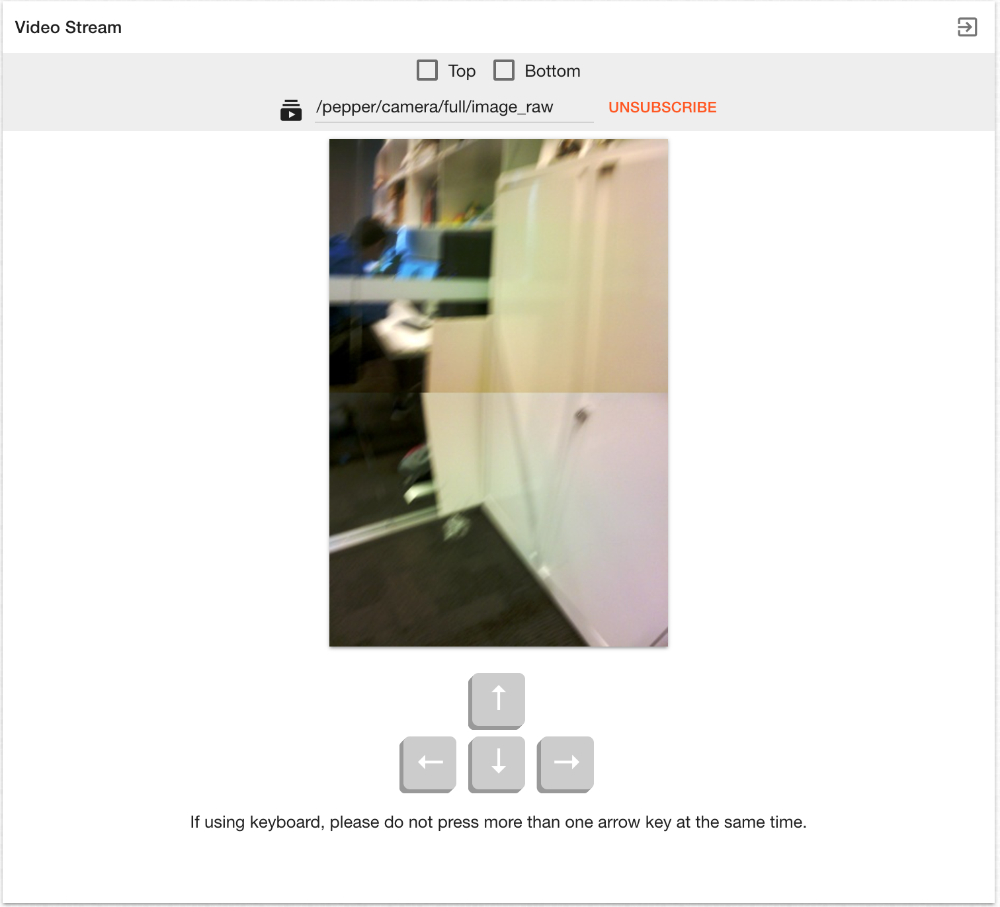

# Pepper Web Tools

## Installation

```bash
npm install
bower install
cd app/bower_components/CodeMirror/ && npm install
cd ../acorn/ && npm install
```

## Development

- Start by `gulp serve`

- Head to [http://localhost:3000](http://localhost:3000) 

- Coding style follows [John Papa's Angular 1 Style Guide](https://github.com/johnpapa/angular-styleguide/blob/master/a1/README.md)

## Deployment

run `gulp`, then `scp -r dist/ nao@pepper.local:/home/nao/web_tools/`

## User Guide

This web application provides widgets and tools for developers to monitor robot's status, get quick access for some resources and prototype your programs.

### Overview

The application uses simple layout: header and content. In the header, it has a battery level indicator which updated every minute, and a menu for easy navigation. All the widgets and tools are located in the main content. In the homepage, by default, you will see all the widgets. They are ready for use once qi session is connected. Each tool will have its own page. At the top right conner of each tool section, a exit button is provided for navigating back to the homepage.
 


### Widgets

The widgets are in homepage. Currently it has three components: tablet, speech and basic awareness.

+ Tablet widget allows you to set brightness of the tablet, show website by typing a valid url and hide the web view. It also provides a quick button to start the [monitor app](https://github.com/le-kang/pepper-monitor).

+ Speech widget allows you to give words or sentences for pepper to say as well as adjust the volume of the speech.

+ Basic awareness widget helps you keep track of the the status of the awareness (pause or resume only), including stimulus detection, tracking mode and engagement mode. You can change them according to your need.

All widgets information will be updated every second.

### Joystick

The joystick is used for moving pepper around. As shown in the picture below, it has a small circle in a big circle. Drag the small circle within the big one will only rotate the robot. Once the small circle id dragged out of the big one, the robot will move the direction where small circle related to the big one. 


### Video Stream

By default, it provides top and bottom cameras stream. It also provides control for moving pepper’s head to adjust view.


You can uncheck one or both of them and subscribe your won image topic. For example, following picture shows a topic named 'pepper/camera/full/image_raw' that concatenate top and bottom camera image vertically to get a full view. 



### Behaviour Manager

Behaviour manager lists all the behaviours, which are divided in 2 groups: installed and built-in. You can start them by clicking the play button, then the play button will be replaced by a red stop button until pepper finishes the behaviour. The manager scans active behaviours every second. Those behaviours will display the stop button (Do not stop them unless you are very sure). You can also filter the behaviours by using keywords or just list running behaviours.


### Code Editor

Code editor allows you to do prototyping and experiments by using LibQi Javascript SDK. All available modules are preloaded and under namespace "qi". The editor provides auto-completion, API docs and code linting. 


The editor is bound with following keys (they are also available by clicking on the question mark button at the bottom left of the editor): 

+ **Tab** - Auto-complete
  
+ **Ctrl-O** - Find docs for the expression at the cursor

+ **Ctrl-I** - Find type at cursor

+ **Alt-.** - Jump to definition (**Alt-,** to jump back)

+ **Ctrl-Q** - Rename variable

+ **Ctrl-.** - Select all occurrences of a variable

Note that unlike python SDK all function calls are in asynchronous manner. Thus, calling LibQi Javascript API will always return a Promise. Following is an example for displaying the Magic Lab website on the tablet.

```javascript
// load the url after showWebview method resolves (succeeds)
qi.ALTabletService.showWebview().then(function() {
  qi.ALTabletService.loadUrl('http://themagiclab.org');
});
```

For more details, please refer to the [offical documentation](http://doc.aldebaran.com/2-5/dev/js/index.html)

The code editor also allows you to save your scripts in the local storage of your browser. The saved scripts will not be lost unless you clear your browser cache, use incognito (or private) mode or change another browser. 


### Lost Connection


Once qi session gets disconnected, you can continue working (e.g. you want to save your script), but you will see the following message at the bottom:


You will have to refresh the page in order to reconnect to the qi session.